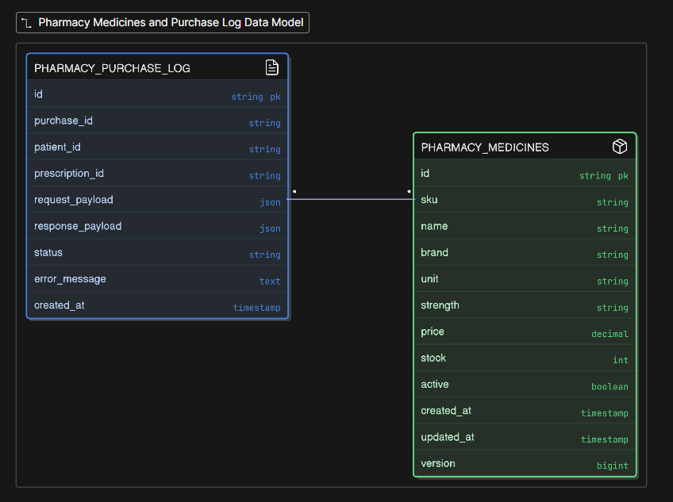
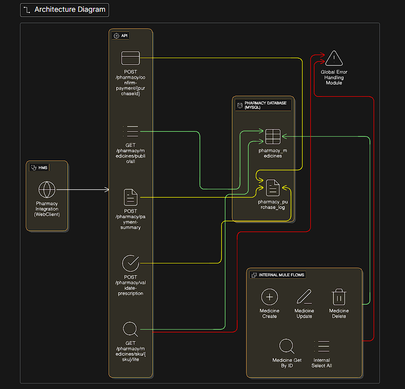

# Pharmacy Microservice — Project Documentation

##  Project Overview
The **Pharmacy Microservice** is a MuleSoft-based integration service that manages medicine inventory, prescription validation, payment processing, and communication with the main Hospital Management System (Spring Boot).  
It ensures accurate stock handling, reliable validation, and secure pharmacy transaction processing.

## Objectives
- Manage pharmacy inventory and pricing.
- Validate prescription medicines against available stock.
- Generate payment summaries and confirm purchases.
- Log all pharmacy transactions for audit and tracking.
- Provide clean public APIs for the HMS to consume.

## Tech Stack
| Layer | Technology |
|-------|-------------|
| Integration | MuleSoft 4.x (Anypoint Studio 7.x) |
| Database | MySQL |
| Backend Services | Mule Flows / Connectors |
| API Style | REST |

## Core Modules

### Medicine Management
- Create, read, update, soft-delete medicines.
- Fetch medicine by ID or SKU.
- Maintain inventory and pricing.
- Support internal and public-facing endpoints.

### Public Medicine APIs
- Lightweight endpoints consumed by Spring Boot.
- Optimized for customer-facing medicine display.
- Includes responses for SKU-based lookups.

### Prescription Validation
- Validates requested medicines against inventory.
- Identifies available, out-of-stock, or missing medicines.
- Returns structured validation summaries to HMS.

### Payment Summary
- Filters payable items from validation results.
- Calculates line totals and overall bill.
- Saves a pending transaction in `pharmacy_purchase_log`.

### Payment Confirmation
- Confirms a purchase via `purchaseId`.
- Reduces stock for all payable items.
- Updates the log entry to `COMPLETED`.

### Global Error Handling
- Centralized flows for:
  - DB connectivity errors  
  - DB query errors  
  - Transformation errors  
  - Not-found errors  
  - Bad request errors  
  - Generic unexpected errors  
  - Ensures consistent and readable error responses across all APIs.

##  Database Overview

### **pharmacy_medicines**
Stores all medicine-related information including SKU, name, brand, unit, strength, price, stock levels, active status, and timestamps.  
Used for:
- Validating prescription items  
- Returning public medicine data  
- Updating stock during payment confirmation  
- Internal CRUD operations  

### **pharmacy_purchase_log**
Stores all pharmacy transaction entries such as purchase IDs, patient and prescription references, request/response payloads, payment summaries, status (PENDING/COMPLETED), and timestamps.  
Used for:
- Recording pending payment summaries  
- Tracking completed purchases  
- Supporting audit and debugging  

## ER Diagram (Structure)

https://app.eraser.io/workspace/cxAtkiqagNdXu86jwOpI?origin=share

## High-Level Architecture (HLD)

https://app.eraser.io/workspace/G1FpZ0VcmBZ7wLS3OPpA?origin=share

## Architecture Overview
The microservice exposes REST endpoints through Mule flows, interacts with MySQL for inventory and transaction records, and is fully integrated with the Hospital Management System.  
Core responsibilities include medicine management, validation, billing, and stock updates.

